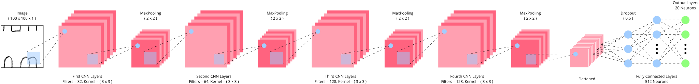
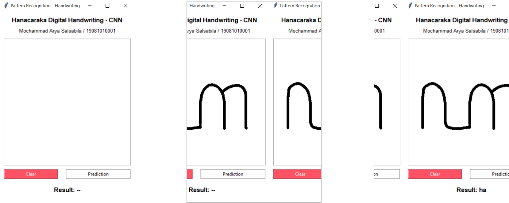

# Hanacaraka-Digital-Handwriting-CNN

Pengenalan Tulisan Tangan Digital Hanacaraka Menggunakan Convolutional Neural Network

## Dataset

```
└─── hanacaraka
    |─── ha ( 510 gambar )
    |─── na ( 510 gambar )
    |─── ...
    └─── nga ( 510 gambar )
```

## Arsitektur Model CNN



## Tampilan Aplikasi



## Video Penjelasan

[](https://youtu.be/yWSgOIkhnNo) 

## License

Distributed under the MIT License. See `LICENSE` for more information.

## Contact

Mochammad Arya Salsabila - Aryasalsabila789@gmail.com
